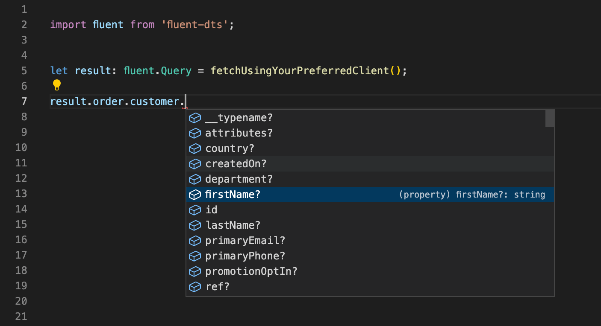
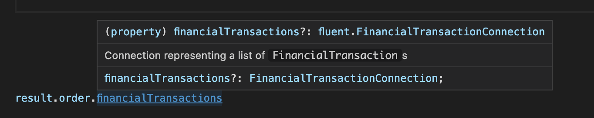

# Fluent commerce type definitions

Ready to use typescript definitions for Fluent Commerce Graphql schema, generated using graphql-codegen.

## Install

```
npm install --save-dev fluent-dts
```

## Usage

The package simply contains type definitions for Fluent types. "Query" and "Mutation" are the root types that you can use for the result returned by a graphql call:


``` typescript
import fluent from 'fluent-dts';

// root types for queries or mutations
let queryresult: fluent.Query;
let mutationresult: fluent.Mutation;

```

Screenshot of vscode autocomplete:



Screenshot of vscode documentation on hover:




## License

Released under the MIT license.
